# Windows Server Active Directory Home Lab

This repository documents a Windows Server AD Home lab that i built in virtual environment.
Goal for this lab was to practice basic Win Server administartion, ad management, DNS, DHCP, Group Policy, sharing permissions and client domain joining.
For this lab i used one Windows Server machine that was used as a Domain Controller and one Windows Client machine that joined my AD domain.

---

## Skills Practiced

Skills that i practiced on this home lab are:
- Windows Server Administration
- AD Domain Services
- Domain Controller setup and configuration
- DNS configuration
- DHCP Scope configuration
- Users, groups and OU
- GPO
- Joining client domain
- Share & NTFS permissions
- Windows troubleshooting
- Network diagnostics

## Server Roles

I configured Windows Server with roles AD Domain Services, DNS, DHCP and Files and Storage Services.

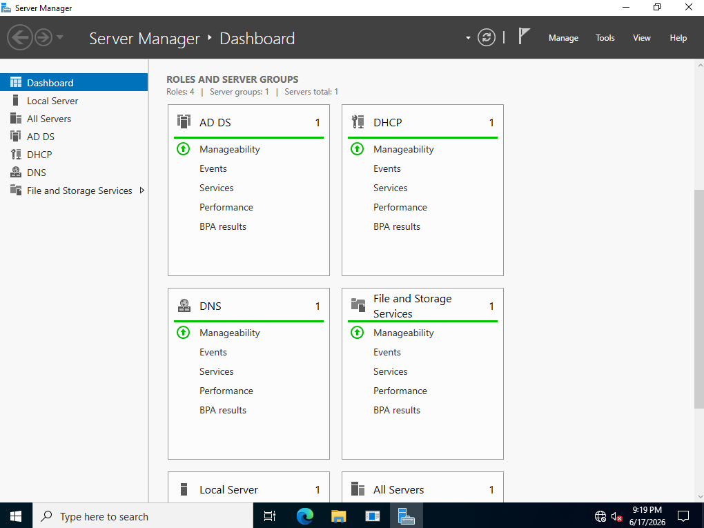

## Active Directory Structure

Created OUs Employees, IT & Marketing to separate users and departments inside the domain. 

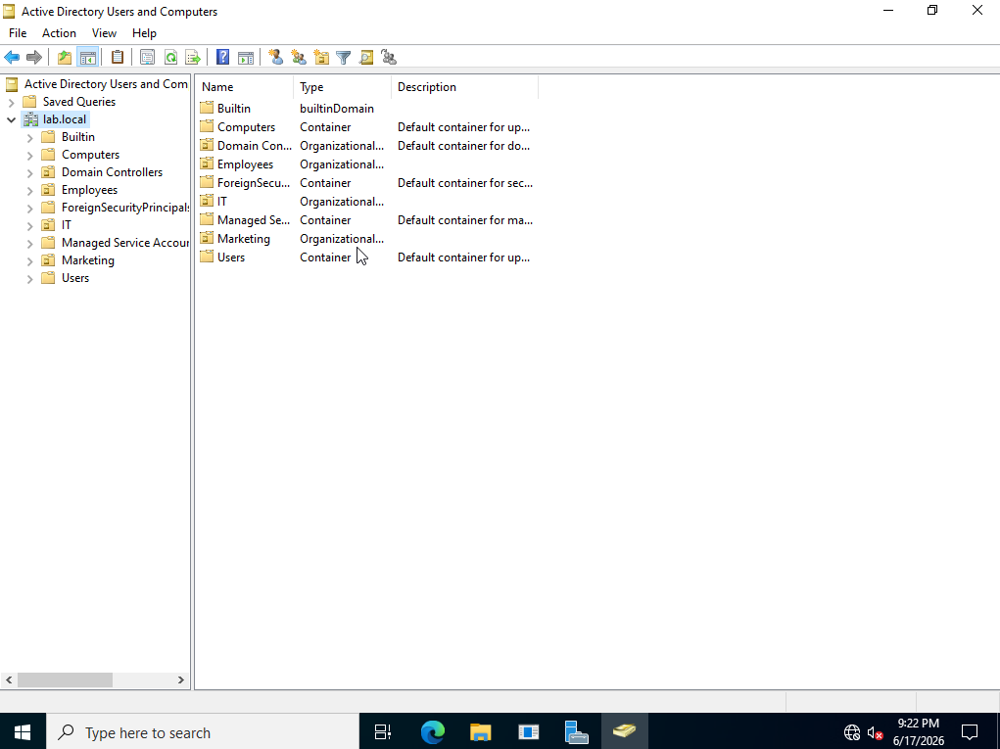

## Users and Groups

Test domain users and groups were created for the lab environment.
This included an IT admin user and a regular employee user for testing permissions and policies and tried setting logon hours.

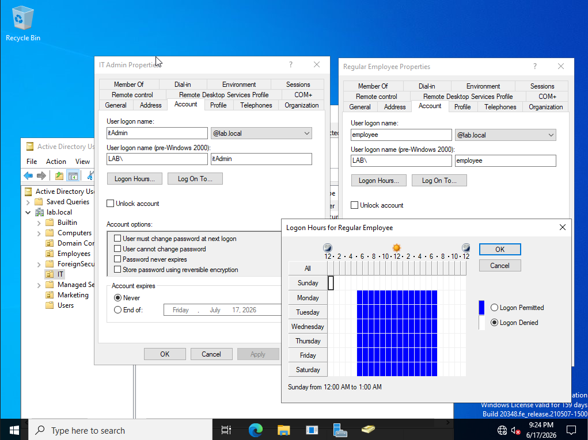

## DNS Configuration

DNS was configured for the lab.local Active Directory domain.
The forward lookup zone contains records for the Domain Controller and the domain-joined Windows client.

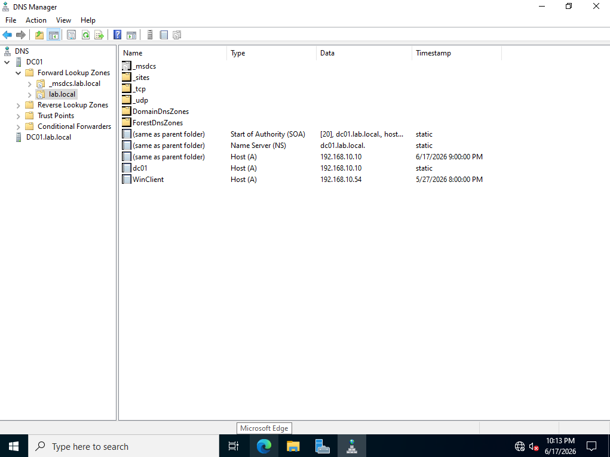

## DHCP Configuration

Configured DHCP scope to automatically assign IP addresses to client machines in the lab network.

DHCP scope:

`192.168.10.50 - 192.168.10.60`

Excluded range:

`192.168.10.50 - 192.168.10.53`

And the Windows client received the IP address `192.168.10.54` after joining the domain.

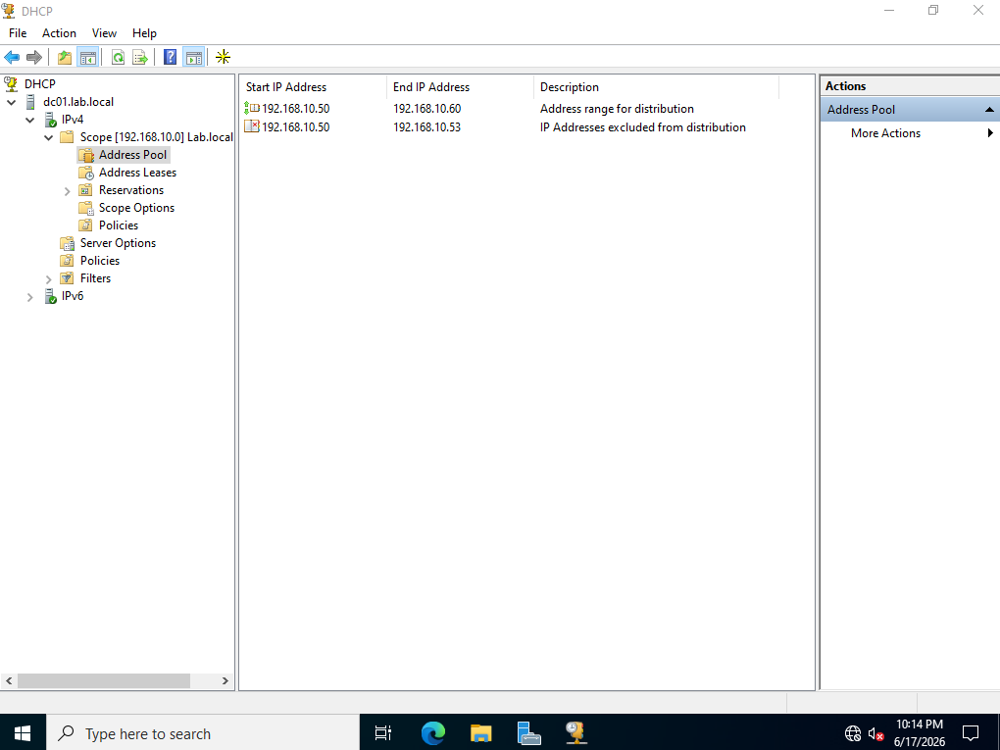

## Group Policy Configuration

I made an GPO named `DisableControlPanel` and linked it to the IT OU

It was used to practice applying user restrictions through AD. 

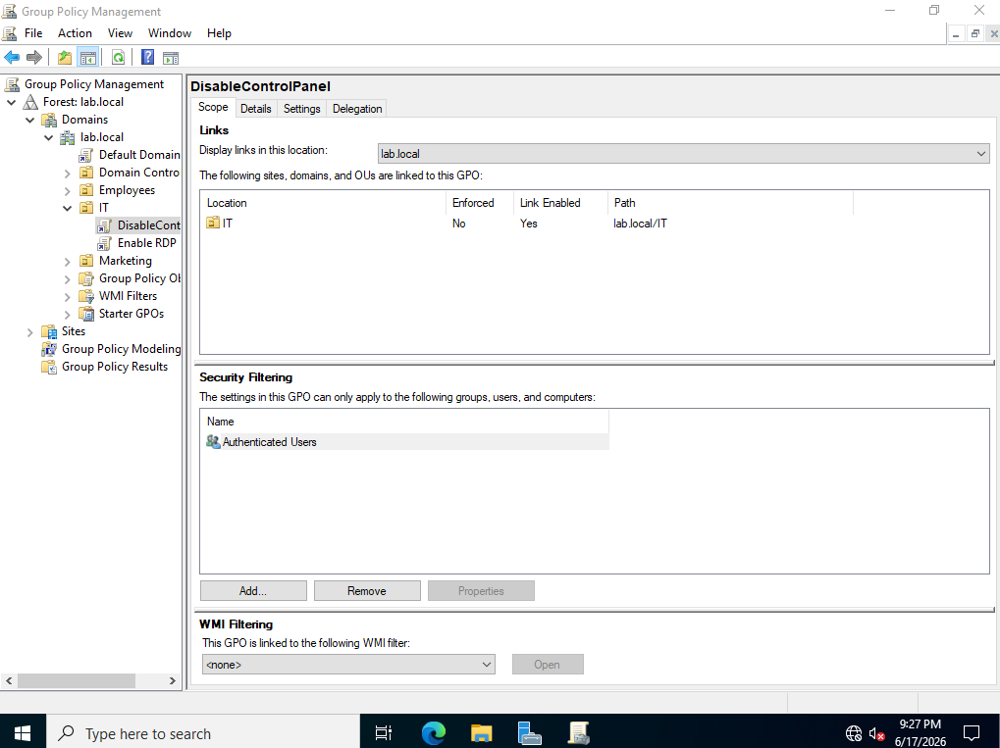

I verified this policy on client machine using `gpresult /r` in cmd to see the group policy results and it showed `DisableControlPanel` GPO was successfully applied to the domain user.

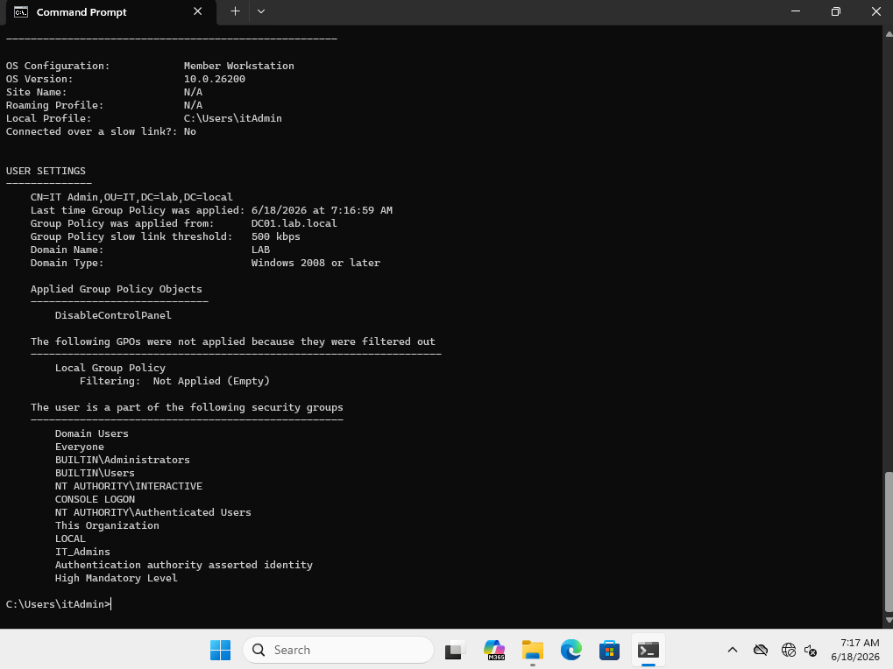

## Shared Folder Structure & Share / NTFS Permissions

Created some shared folders on the server ( IT & Marketing) and applied Share Permissions to them. 

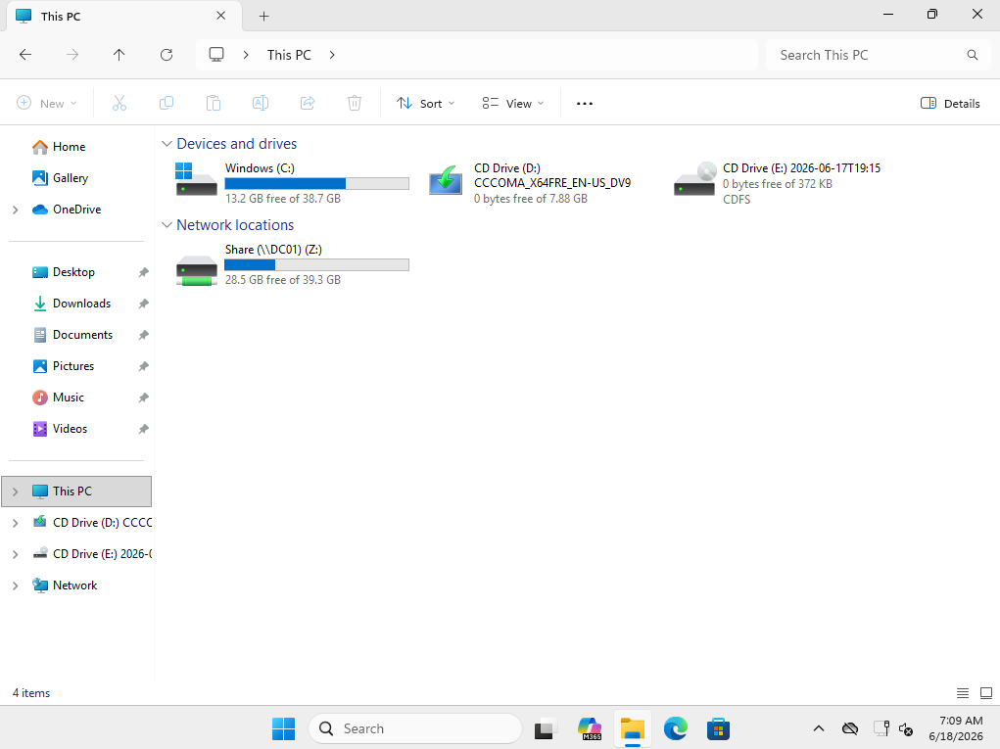
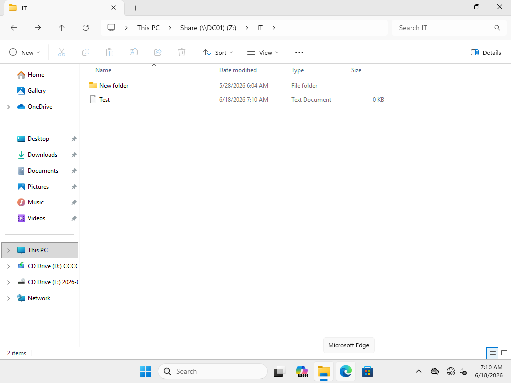

IT folder was shared over the network and i set Read and Change share permissions to it for the IT_Admins group 

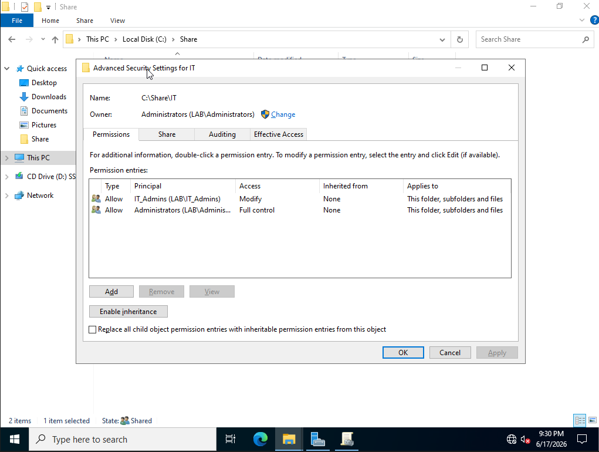

and also i configured NTFS permissions on IT folder, IT_Admins group was granted Modify permissions while Admin had Full Control.

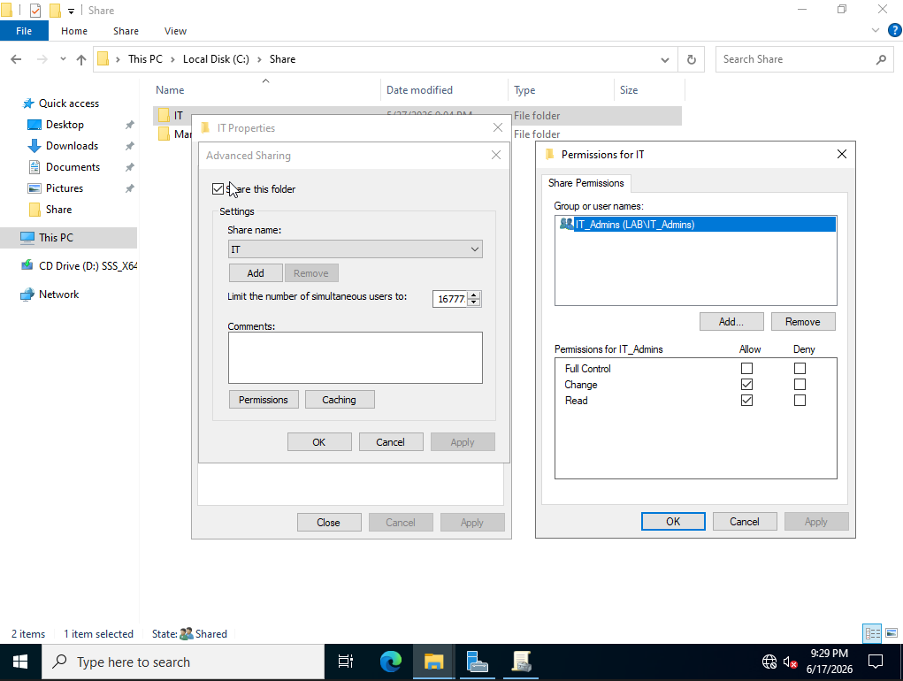

## Client Domain Join

I sucessfully joined `lab.local` AD domain with my Windows Client machine.

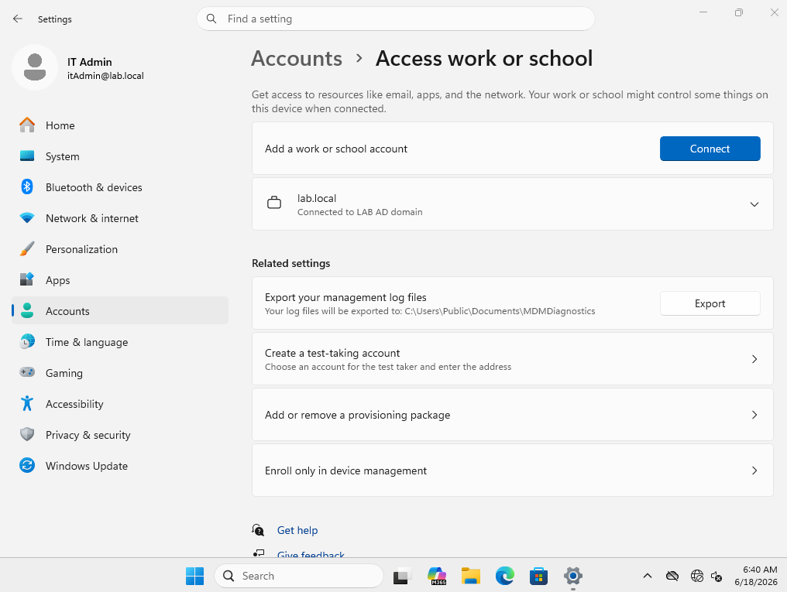

Tested the domain login with an cmd command `whoami`

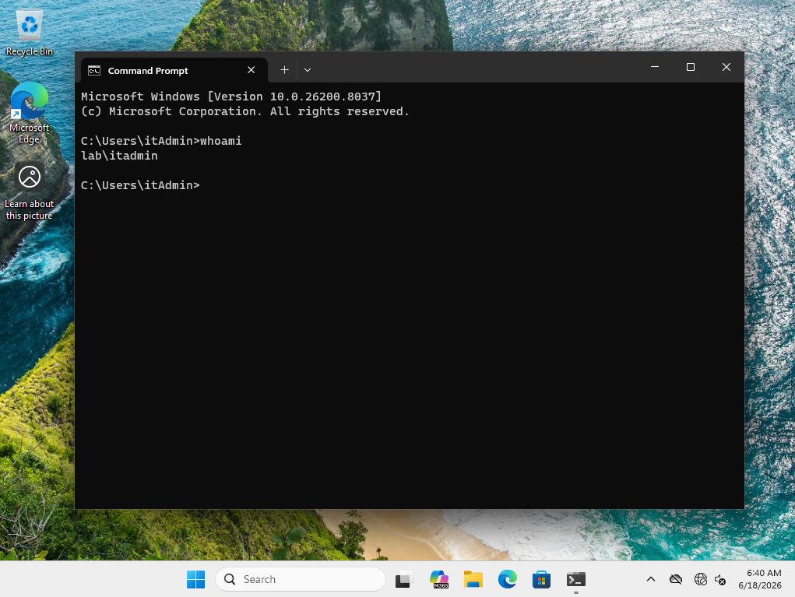

## Client Network Tests

I did some basic network troubleshooting with commands:
```
ipconfig /all
ping dc01
nslookup lab.local
```

And results of this confirmed that the client received an IP address from DHCP, 
the dhcp server was `192.168.10.10`, DNS server was `192.168.10.10`, Client could ping DC 
and the domain name lab.local resolved successfully

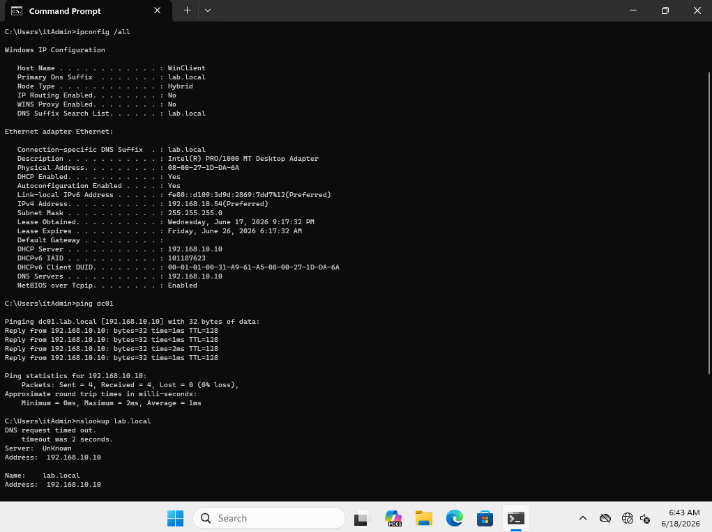


## What I Learned from this homelab

This lab helped me understand how Win Server and AD are used to manage users, devices, permissions, DNS, DHCP and group policy in a company environment

Also helped me practice some basic troubleshooting steps such as checking ip configs, veryfing DNS, testing network connectivity to the AD, checking and testing permissions and sharing files over the network and 
checking applied Group Policies, learned some new cmds like for forcing group policy update (`gpupdate /force`).

And it was a lot of fun to do this homelab, time flied away as i enjoyed solving problems and creating all this.

## Useful Commands

Some useful commands that hepled me resolve and test everything that i made in this homelab are:

```
ipconfig /all - this command provides detailed network information
ping dc01 - used this to check my connectivity to the server
nslookup lab.local - used to translate domain names into IP address
whoami - display current logged in user
gpupdate /force - force update group policies
gpresult /r - shows results of group policies on current user
```
